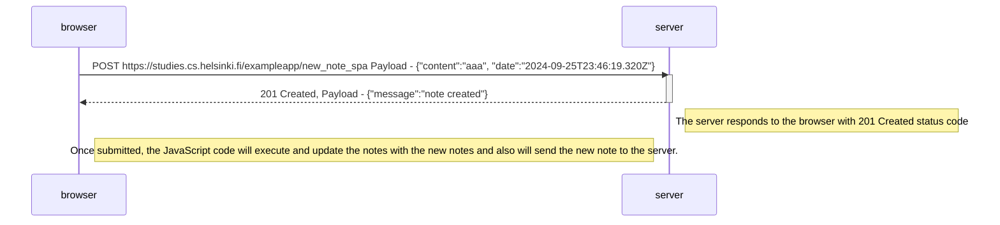

```mermaid
sequenceDiagram
    participant browser
    participant server

    browser->>server: POST https://studies.cs.helsinki.fi/exampleapp/new_note_spa Payload - {"content":"aaa", "date":"2024-09-25T23:46:19.320Z"}
    activate server
    server-->>browser: 201 Created, Payload - {"message":"note created"}
    deactivate server

    Note right of server: The server responds to the browser with 201 Created status code
    Note right of browser: Once submitted, the JavaScript code will execute and update the notes with the new notes and also will send the new note to the server.
```
